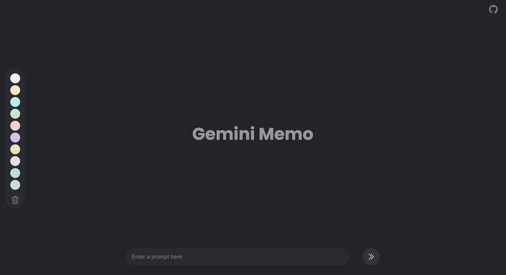
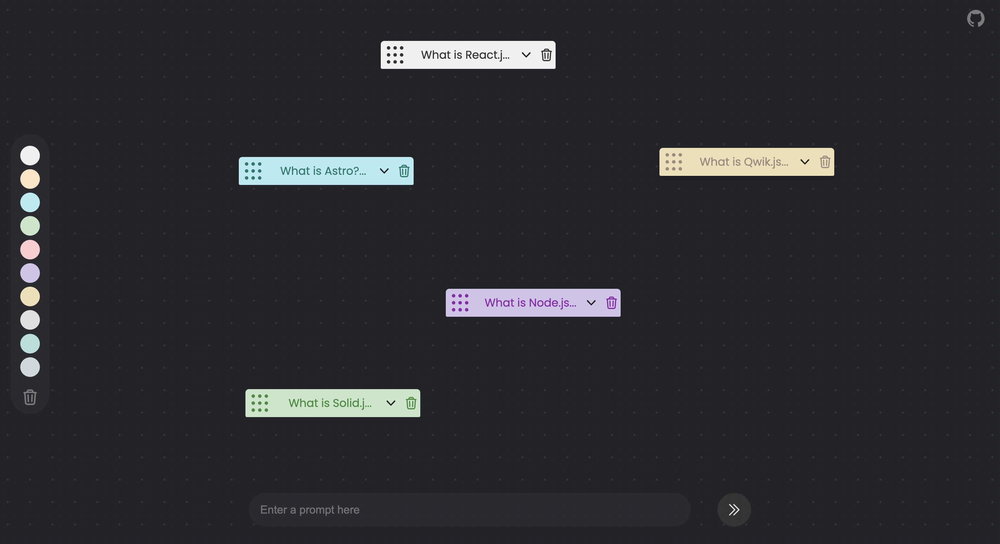
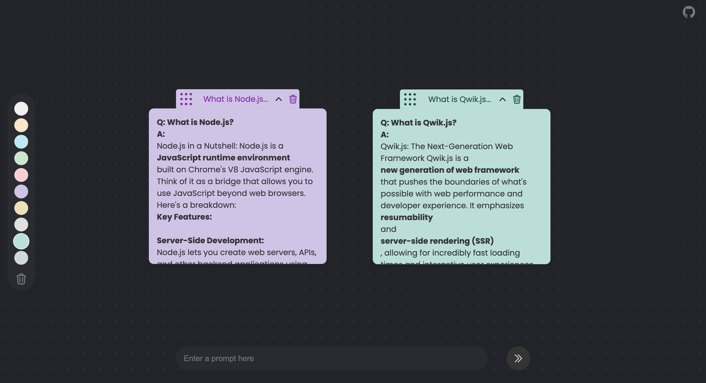

# Gemini Memo

Gemini Memo is a web tool that integrates with the Gemini API to create and manage digital memo - memorandum with customizable colors and drag-and-drop functionality. This application is perfect for organizing information, brainstorming ideas, and creating mind maps.

- React.js (Context API), CSS Modules, Vite (Frontend tooling), Figma (Design tool) and Netlify (Hosting).

## Demo







## Features

- [x] Create and manage memos based on Gemini API responses.
- [x] Customize memo colors and positions on the screen.
- [x] Drag-and-drop functionality for easy memo management.

  - Mouse down and drag to move memo.
    (or)
  - Double-click and drag to move memo.

  #### Features to be added in the next version:

  - [ ] An infinite canvas with drag functionality will be added.
  - [ ] Ability to connect memos with arrows to create mind maps will be added.
  - and many more...

## Installation

Follow these steps to set up Gemini Memo on your local machine:

1. Fork the repository on GitHub.

2. Clone the repository:

   ```bash
   git clone https://github.com/your-username/GeminiMemo.git
   cd GeminiMemo
   ```

3. Install dependencies:

   ```bash
   npm install
   ```

4. Start the development server:

   ```bash
   npm run dev
   ```

   The app will now be running on `http://localhost:5173/` or another port.

## Configuration

To use the Gemini API, you need to obtain your API key and configure it in the project. Follow these steps:

1. Get your Gemini API key `API_KEY` from the Gemini API provider.

2. Set up the API key in the project configuration:

   - Navigate to `src/config/gemini.js`.

   - Initialize the API key in your code:
     ```js
     // Initialize the API key
     const apiKey = API_KEY;
     ```

## Usage

1. Enter a question in the input field to fetch information from the Gemini API.
2. Each question's response will be displayed as a memo.
3. Drag and drop memos on the screen to organize them.

## Contact

If you have any questions or suggestions, feel free to open an issue or reach out to me!

<a href="https://github.com/Vasudevatirupathinaidu" target="_blank"></a> <a href="https://medium.com/@tirupathinaidu" target="_blank"></a> <a href="https://dev.to/deva" target="_blank"></a> <a href="https://twitter.com/vasudev617" target="_blank"></a> <a href="https://www.youtube.com/@vasudev16180" target="_blank"></a>
